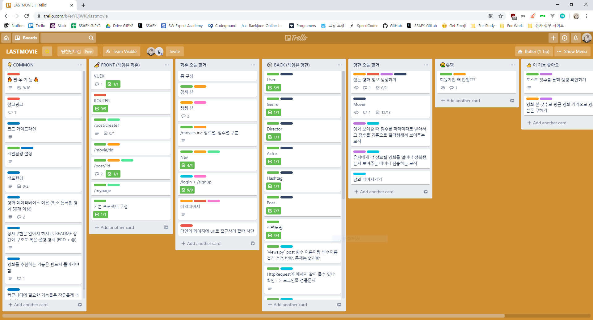
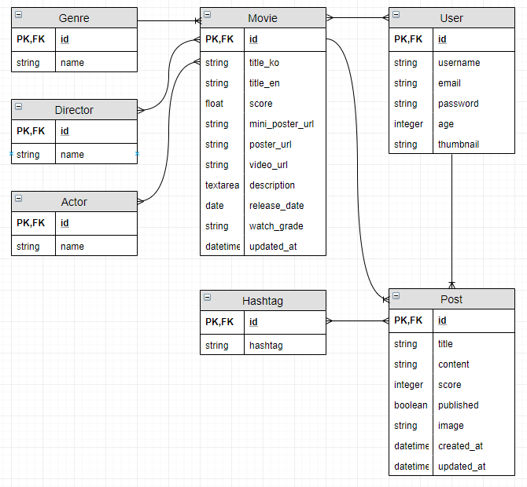

# README

## 마이무비리스트

> 2019.11.21 ~ 2019.11.28까지 진행된 SSAFY 최종 프로젝트

### 개발 과정

#### 0. 프로젝트 기획

##### 1. 팀원 정보 및 업무 분담

- 조장 : 김혁준 (역할 : front-end 제작 및 유지 보수)

- 조원 : 정명한 (역할 : back-end 제작 및 유지 보수)

##### 2. 목표 서비스 구현



1. front-end

- 전체 DB에 존재하는 영화에 대한 정보에 대한 뷰 제공

- 최신 영화, 핫한 영화, 장르별 영화 등 사용자가 원하는 영화에 대한 뷰 제공

- 각 유저 별 추천 영화, 유저가 작성한 포스트, 유저의 포스트 랭킹 등 유저 관련 정보에 대한 뷰 제공

- 유저 정보, 포스트 정보에 대한 CRUD 뷰 제공

2. back-end

- ERD에 맞는 영화 정보 DB 생성

- front-end에서 유저가 원하는 정보에 대한 API 생성 및 정보 제공

- 유저가 요청한 CRUD에 대한 처리 및 에러 결과 반환 처리

3. modeling



> ERD

- Movie를 기준으로 다른 모든 정보에 접근이 가능합니다.

    - Genre, Director, Actor에 대해 1:N으로 연결되어 있습니다.

    - User와 M:N으로 연결되어 특정 사용자가 해당하는 영화를 보았는지 아닌지를 판단할 수 있습니다.

    - Post와 1:N으로 연결되어 각 영화에 작성된 포스트를 찾아볼 수 있습니다.

- 한편, Post를 기준으로 다른 정보에 접근이 가능합니다.

    - User와 1:N으로 연결되어 각 유저가 작성한 포스트를 확인할 수 있고 그 포스트에 맞추어 맞춤 정보를 제공할 수 있습니다.

    - Hashtag와 M:N으로 연결되어 자동으로 포스트에 작성된 해시태그를 생성하고 찾고 수정하고 지워줍니다.

### 느낀 점

#### 1. Back-end

1. front와의 소통이 매우 중요합니다.

    - front가 필요로 하는 정보가 무엇인지 정확히 파악하여 해당 정보를 제공할 수 있어야 합니다.

2. 검증을 최대한 해야합니다.

    - front에서도 검증을 하겠지만 그를 뚫고 들어오는 로직에 대한 공격을 방어하기 위해서 최대한 많은 예외 상황을 확인해야 합니다.

##### 1. back-end 오류 및 해결

1. `In order to allow non-dict objects to be serialized set the safe parameter to False.`
  
    - serializer가 `object`타입이 아닌 다른 타입의 파일을 받을 경우 발생하는 오류입니다.
    
    - ECMA-5 이전에 보안에 취약한 점을 방어하기 위해 `safe=True`가 기본으로 주어져 있고 이는 리스트 등의 serialize를 막습니다.
    
    - 해결하려면 `return JsonResponse()`에서 `safe=False`로 바꿔야 합니다.
  
2. 유저 항목 입력 시 주의사항
  
    - 선호 장르 같이 모델에 직접적인 수정이 필요한 경우 이를 따로 분리하여 연결하는 쪽이 편리합니다.
  
3. 비밀번호 암호화하기

      1. `serializer`에 `request`의 데이터를 담은 뒤 검증합니다.
      
      2. 저장을 중단하고 우선 유저 인스턴스로 변환해 유저 정보를 저장합니다.

      3. 유저 모델의 method인 `user.set_password()`를 사용하여 인스턴스의 비밀번호를 암호화 합니다.

      4. 다시 유저 인스턴스를 저장하여 암호화된 비밀번호를 반영합니다.
  
4. 회원가입하면서 자동으로 로그인하는 토큰 넘겨주기
  
    - `rest_framework_jwt.settings`에 있는 `api_settings`를 가지고 `jwt_payload_handler`와 `jwt_encode_handler`를 통해 자동으로 토큰을 생성합니다.
  
5. DB update하기

    - API를 거치고 거쳐가며 데이터를 입력받고 그 데이터를 하나씩 가져오거나 저장합니다.

        - 데이터가 존재하는 경우 : DB의 빈 필드와 이전 정보를 업데이트 합니다.
        - 데이터가 없는 경우 : 생성합니다.

6. `many-to-many`의 데이터 추가하기

```python
movie, created = Movie.objects.get_or_create(params=params)  # 영화를 생성해야하는지 아닌지 검증하고
if created:  # 생성되었으면
    for director in directors:  # 감독을 돌면서
        director = get_object_or_404(Director, name=director)  # 감독 인스턴스를 가져오고
        movie.directors.add(director)  # 감독을 추가합니다.
    for actor in actors:
        actor = get_object_or_404(Actor, name=actor)
        movie.actors.add(actor)  # 배우도 동일하게 진행
```

