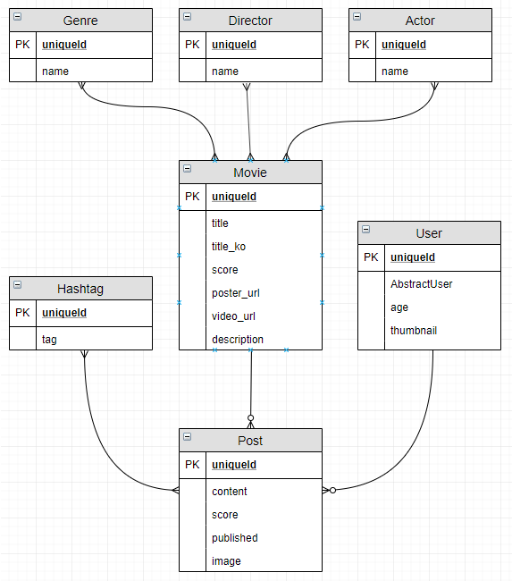

# README

## 마이무비리스트 백엔드

> 개발하기 너무 어려운 걸;;

### 개발 과정

#### 1. modeling



> ERD

### 오류 및 해결

- serializer에서 `In order to allow non-dict objects to be serialized set the safe parameter to False.`가 발생하는 경우
  
  - `return JsonResponse()`에서 `safe=False`라는 속성을 부여해야합니다.
  
- 유저 항목 입력 시 주의사항
  
  - 선호 장르 추천과 같이 모델에 직접적인 수정이 필요한 경우 이를 따로 분리하여 연결하는 쪽이 유리합니다.
  
- 비밀번호 암호화하기
  - `passlib`를 install하고 `passlib.hash`내부에 존재하는 `django_pbkdf2_sha256`을 사용하여 암호화를 합니다.
  - `serializer`를 잠시 중단하고 password를 암호화한 뒤 `serializer`를 저장하면 완료!
  
- 회원가입하면서 자동으로 로그인하는 토큰 넘겨주기
  
  - `rest_framework_jwt.settings`에 있는 `api_settings`를 가지고 `jwt_payload_handler`와 `jwt_encode_handler`를 통해 자동으로 토큰을 생성하고 그를 JSON으로 넘겨줍니다.
  
- DB update하기

  - API를 거치고 거쳐가며 데이터를 입력받고 그 데이터를 하나씩 가져오거나 저장합니다.

    - 데이터가 존재하는 경우 : DB 데이터를 리턴합니다.
    - 데이터가 없는 경우 : 생성합니다.

  - 포스터 url을 크로울링을...

  - many-to-many 필드의 경우 감독, 배우에 대한 정보를 가져오고 그 정보를 토대로 m:n 필드에 추가해줍니다.

    ```python
    movie, created = Movie.objects.get_or_create(title=title, title_ko=title_ko, score=score, poster_url=poster_url, video_url=video_url, genre=genre)  # 미리 영화를 생성해야하는지 안 그래도 되는지 검증하고
    if created:  # 생성된 영화라면
        for director in directors:  # 감독을 돌면서
            director = get_object_or_404(Director, name=director)
            movie.directors.add(director)  # 감독 필드에 감독을 추가합니다.
        for actor in actors:
            actor = get_object_or_404(Actor, name=actor)
            movie.actors.add(actor)  # 배우도 동일하게 진행
    ```

    